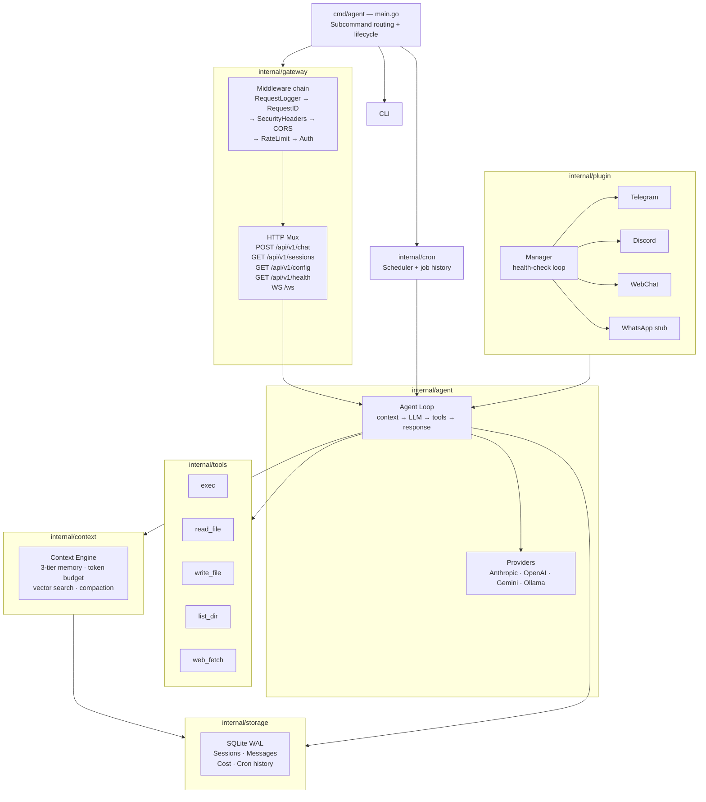

# Architecture Overview



## HTTP Middleware Chain

Requests pass through the following middleware stack (outermost → innermost):

```
RequestLoggerMiddleware   — structured access log with duration
  RequestIDMiddleware     — generates X-Request-ID UUID, attaches to context
    SecurityHeadersMiddleware  — X-Content-Type-Options, X-Frame-Options, CSP
      CORSMiddleware      — cross-origin headers
        RateLimitMiddleware (100 req/min per IP)
          AuthMiddleware  — Bearer token check (skips /api/v1/health)
            mux           — route dispatcher
```

## Adapter Lifecycle

Each adapter (Telegram, Discord, WebChat, WhatsApp) implements `plugin.Adapter`:

| Method | Description |
|---|---|
| `Name() string` | Unique identifier used for routing and logging |
| `Start(ctx, inbound, outbound) error` | Blocks; reads/writes message channels |
| `Stop()` | Gracefully closes connections |
| `Health() error` | Polled every 30 s by the Manager's health-check loop |

## Data Flow (One Message)

```
User input
    ↓
Context Engine assembles prompt:
  [System prompt]  ← identity.md + user.md + tools + injection guard
  [Tier 3 memory]  ← memory.md (persistent facts)
  [Tier 2 history] ← semantic search (vector embeddings)
  [Tier 1 recent]  ← last 3-5 turns
  [User message]   ← current input
    ↓
LLM Provider (Anthropic / OpenAI / Gemini / Ollama)
    ↓
  If tool calls → execute tools → wrap results → re-call LLM
  If text response → done
    ↓
Store to SQLite (session, messages, cost record)
    ↓
Response to user
```

## Package Map

| Package | Responsibility |
|---|---|
| `cmd/agent` | CLI entry point, subcommand routing, lifecycle wiring |
| `internal/agent` | Agent loop, LLM providers, retry/failover |
| `internal/context` | Token budget, embeddings, vector search, context assembly |
| `internal/gateway` | HTTP/WS server, auth, rate limit, CORS, security headers, request tracing |
| `internal/tools` | Built-in tools, safety enforcement (command sandbox) |
| `internal/storage` | SQLite DB, migrations, repositories |
| `internal/config` | YAML loading, env overrides, defaults, validation |
| `internal/cli` | Interactive REPL, display formatting |
| `internal/plugin` | Channel adapter manager, health-check loop, message router |
| `internal/rpc` | gRPC AgentCore + ChannelAdapter services for out-of-process adapters |
| `internal/cron` | Scheduled task scheduler, job history |
| `internal/workspace` | Personalization file loader (`identity.md`, `user.md`, `memory.md`) |
| `internal/cost` | Token usage tracking and cost estimation |
| `internal/logger` | Structured slog logger with secret scrubbing and trace ID injection |

## Dashboard Control Plane (Service Layer)

The dashboard now has a thin control-plane layer in `internal/gateway` that exposes runtime operations without changing the core agent loop design:

- Chat controls: `POST /api/v1/chat/abort`, `POST /api/v1/chat/inject`
- Channel controls: `POST /api/v1/channels/action`, allowlist endpoints under `/api/v1/channels/allowlist*`
- Session controls: `GET /api/v1/sessions/{id}/stats`, `GET|PUT /api/v1/sessions/{id}/overrides`
- Instance controls: `POST /api/v1/instances/action`
- Cron controls: `GET|POST /api/v1/cron/jobs`, `PUT|DELETE /api/v1/cron/jobs/{name}`, `PUT /api/v1/cron/jobs/{name}/enabled`
- Agent controls: `GET|POST /api/v1/agents`, `PUT|DELETE /api/v1/agents/{id}`, `POST /api/v1/agents/{id}/activate`
- Session profile binding: `GET|PUT /api/v1/sessions/{id}/agent`
- Skills controls: `GET|POST /api/v1/skills`, `PUT /api/v1/skills/{name}/enable|disable`, `DELETE /api/v1/skills/{name}`
- Node controls: `POST /api/v1/nodes/action` (`capabilities`, `test`, `restart`)
- Debug controls: `POST /api/v1/debug/action`, `GET /api/v1/debug/events`
- Log controls: `GET /api/v1/logs` with filter params + `GET /api/v1/logs/export`

Architecture impact:

- No new external service dependency was introduced.
- Existing `agent → context → tools → storage` runtime flow remains unchanged.
- New handlers are orchestration-only and delegate to existing runtime/storage components.
- Cron scheduling now supports two sources: config-defined jobs (`config.yaml`, read-only at API) and persisted DB jobs (`cron_jobs`, mutable at runtime).
- Agent profiles are persisted in `agent_profiles`; sessions can carry `agent_profile_id`, and new REST/WS sessions auto-bind to the active profile when one exists.

## Key Design Decisions

**Why Go?** Single static binary, fast startup, excellent concurrency, clean interfaces.

**Why SQLite?** Zero dependencies, WAL for concurrency, runs everywhere, 0600 permissions for privacy.

**gRPC out-of-process adapters** are available as of v1.1. Enable with `gateway.grpc_port: 18790`. The `AgentCore` service accepts inbound messages; the `ChannelAdapter` service allows the agent to deliver responses back. See `proto/agent.proto` for the full contract.

**Why ~500 token system prompt?** OpenClaw uses 5,000–10,000 tokens on the system prompt. Ours is 10× smaller, leaving more budget for actual conversation history.

**Why UUID request IDs?** Structured logs and trace IDs allow correlating a complete request lifecycle (auth, LLM call, tool execution) in a single log grep.
